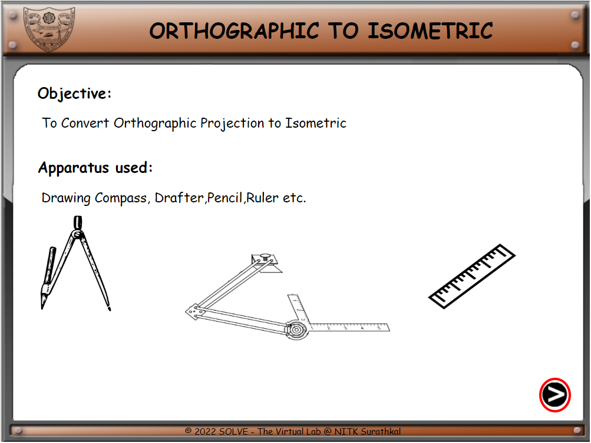
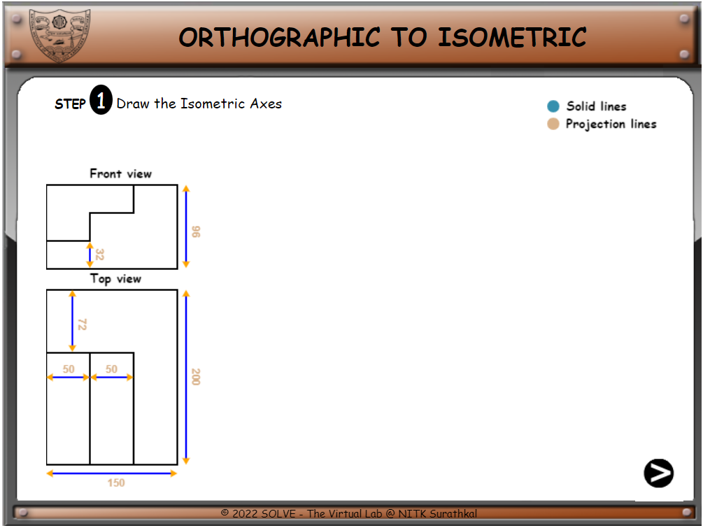
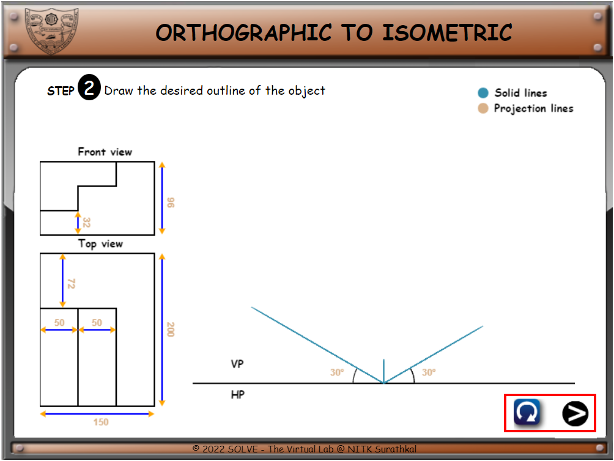

1)  Click on **“Isometric projection”** the following window will
    open. Click on the NEXT button to proceed.

2)   On clicking the NEXT button you can proceed to the next step of construction.  
    Again by clicking the NEXT button, We proceed to Step 2.

3)   Here similarly by pressing the Next button we proceed to step.
    In the right-hand corner, a Reset button**  appears.

4) Finally, after following all the steps, we reach the final projection.

5) At any step in between, if the Reset button
 gets clicked, the whole board resets to Step1.

